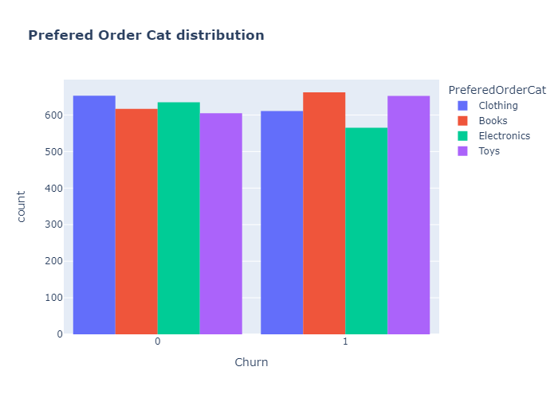

# Churn Prediction task

The aim of this taks is to build a mcahine learning model to predict customer churn for a subscription-based suervice. Customer churn, and the rate at which customers leave a service is a critical metric for a business success. The goal of this assignment is to develop a predictive model that can identify cusomers at rist churning based on the historical data.

# Main steps taken

The notebook is separated into several sections:

- Exploratory data analysis, where insighst from the data is shown
- Missing data management
- Data visualization
- Feature Engineering
- Outliers identification
- Data preprocessing
- PCA analysis
- Model training and evalutation

These steps are taken to secure that data is ready to use.

# Exploratory Data Analysis

The data itself consist of 30 columns and 5000 entries. Provided dataset have information regarding CustomerID, Age, Address, Monthly Spend, Contract Length and other features which describe customer.

There several categorical columns such as Address, Payment method, Device type, Preferred login device, City tier, Preferred payment mode, Gender, Prefered order category and marital status.

There are multiple columns which are showing financial state of the customer such as Monthly spend, Monthly discount, Coupon udes Order amount from last year, Cashback amount

There are columns which are identifying type of product such as Product ID, Preferred ordser category,

Data also conatins information about the distance between the warehouse and user's address - Warehouse to home

User engagement is also measured, it is presented directly by Satisfaction score and indirectly by Trenue.

As we may see from the figure above the data is very much mixed in terms of churn and there's no straight answer what causes customers to churn on this stage.

There are 4 categories which are represented in the data books, clothing, toys and eletronics. Information from this column can be used for the feature engineering. 

Considering Address column, all customers are based in the US in the various states such as KS, TX, AL, NC, FM, CO and others.

___
# Missing Data Management

Not all algorithms are able to deal with missing values. Therefore it is important to address them wisely. Since replacing or deleting values can potentially introduce bias to the Machine Learning model.

As for the marital statuse there are only either married or single customers. Both categories equally represented in the data.

The top customers who did the most transactions are only few. The highest number of the transaction per customer is 5. On average, customer does only 1 transaction according to the data.

The only column which have missing values is `SupportTickets`. The figure below is created using library `missingno`.

These missing values dependent on the `CashbackAmount`.

But if we consider looking at the distribution of the cashback amount for the missing or existing support tickets. There no straightforward answer on what type of dependenci there is.

<b> CahsbackAmount distribution for missing SupportTickets </b>

  

<b> CahsbackAmount distribution for existing SupportTickets </b>

  

Since missing `SupportTickets` column is equally represented for the churn customers as well as for the customers who decided to stay with the company it is a lot safer to replace missing values with the `median` values for the support tickets.

___
# Data Vizualization

Data vizualization is a part of EDA process which is aimed to help in understanding data better.

If we consider looksing at the gender of the customers for those who decided to churn and who decided to stay we will not see any differece in those two.

Thus, the data looks very balanced in terms of categorical values for churn, there one which stands out. It is a preferred order category, where for those who decided to move with another company the category of electronic is less frequent, clothing and books are more frequent. Which mean that customers which prefere books and clothing category are seems to be more likely to churn.

Other columns with `dtype` of `float` were investigated using histplot. The most interesting findings are:

Customers who have higher montly spend having higher chance to churn, which is somewhat counter-intuitive.

Customers who's distance between thir address and home is longer are more likely to churn.

Customers who have lower cashback amount and maximum cachback amount are more likely to churn.

The values of the `int` `dtype` were investigated using bar chart. The most interesting findings are presented below.

The longer the contract for the customer the less likely customer to churn.

Customers with higher satisfaction score are less likely to churn.

There are 2 thresholds 3 and 6 hours. After 3 to 6 there are less users that churn. If user spend more than 6 hours on app he or she is less likely to churn.

The more order is made by user the less chance of churn is. Thus, there's one case that stands out is 8 items, this can be related to the sampling that was made and needs further investigation.

There are several products which seems not satisfy customers and causing churn. Such product IDs as  102, 104, 106, 107, 108, 110, 117. Quality of these products should be investigated by the platform owners.

Dataset itself doesn't have any outliers. The mean values for the customers who churn or decided to stay in the company is on the same level. More infromation is provided in the Jupyter notebook.

___
# Feature Engineering

Considering the information above, the dataset is very balanced in terms of the churn and values distribution which may have negative effect on the prediction. Therefore additional features were created.

- Total categories ordered - this feature calculates the total number of unique categoried ordered by each customer.
- Coupon used to order count ratio - this feature calculated the ratio of the number of coupons used to the total order count for each customer.
- Monthly spend per category
- Average cashback amolunt per order
- Buying frequency
- State, city - those features are extracted from the `Address` column
- Support ticket ratio
- Loaylty Indicator
- Discount utilization rate

After carrying out correlation analysis features number of device registered, number of address, order amount hike from last year were dropped due to the low correlation with the churn.

___
# PCA Analysis

To better understand underlying structure of the data Principal Component Analysis should be carried out. As the result of the analysis, having our features scaled we can see the shape of the data in regards to churn.

From the PCA it seems like the data is very much mixed and there is no clustering or trend withing the data. One way to address that and prove or disprove this statement is to plot PCA analysis for 3 components.

From the 3D view it looks like there's not visible clusters.

____
# Model Training and Evaluation

Data was divided into train and test data as 70% to 30%. `RandomForestClassifier` was used as the machine learning model.

Overall resuts of the model is unsatisfactory. Having accuracy as a metric intend to distinguish customers who is likely to churn in order for the service to stimulate them.

The current model's limited performance, with an accuracy slightly above 50%, suggests that the features being used may not effectively distinguish between customers who churn and those who do not. Key indicators such as warehouse distance, monthly discount, contract length, and average cashback, while significant, do not seem to provide enough discriminative power. This might be due to several reasons:

1. It's possible that the data available lacks crucial variables that are more directly related to customer churn. The current features might not capture the underlying reasons why customers are leaving, such as customer service quality, product satisfaction, or competitive market changes.
2. There could be external factors not captured in the dataset that are influencing churn. Market trends, competitor actions, or changes in customer preferences might be relevant.

I suggest to gether data from the external services or add a survey to get feedback from the customers.